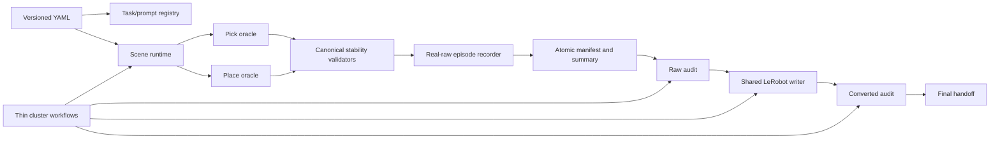

# Architecture

## Responsibilities

- `registry.py` owns the six machine IDs, canonical prompts, aliases, task kind,
  and required scene objects.
- `config.py` loads a typed plan and rejects count, prompt, distractor,
  verification, and path inconsistencies before compute work.
- `task_scenes.py` activates only required clean-scene bodies. Size-comparison
  tasks keep both blocks. Place initializes the one free pepper once from the
  TCP-relative transform.
- `build_xarm6_pick_scene.py` preserves the calibrated camera model and gives
  the rendered multi-lobe free pepper one convex torso contact surface. This
  prevents loss of every finger contact as overlapping lobes rotate; the body
  remains free under normal contact, actuator force, friction, and gravity.
- `task_scenes.yaml` selects an explicit contact profile on that same free
  body: `compound` for acquiring an irregular tabletop pepper in Pick and
  `convex` for a non-redundant already-held Place reset. Neither profile adds
  an attachment, equality constraint, body swap, or pose control.
- `oracle_controller.py` owns separate Pick and Place state machines. Pick
  cannot complete from the legacy short success streak. Place starts at
  `MOVE_TO_PREPLACE` and includes release, retreat, and verification.
- Each Pick plan carries explicit closed-gripper and vertical TCP-to-object
  grasp parameters in the versioned YAML. The red-pepper `250/-0.022 m`
  override is geometry-specific and does not alter the shared validator.
- `stability.py` is the single implementation of Pick stability, initial Place
  grasp stability, and stable Place release. Collection and audits consume its
  metadata rather than reproducing success logic.
- `real_raw_recorder.py` writes observations and the next-row action convention
  shared with real xArm conversion. The pre-recording Place validation is never
  passed to the recorder.
- `collection.py` owns deterministic requested indices, task seed ranges,
  retries, accepted/failed separation, atomic manifests, summaries, and visual
  artifacts.
- `conversion.py` validates accepted metadata, canonicalizes prompts, excludes
  failed attempts, and calls the shared xArm LeRobot writer.
- `audit.py` checks prompt/count/index/dimension/finite/image/validation
  invariants for raw, smoke, and converted outputs.
- `safety.py`, `status.py`, and `reporting.py` own exact-root replacement,
  permissions, resumable phase state, audit prose, and handoff state.
- `cluster/` contains resource profiles and thin phase orchestration; task
  definitions and scientific validation never live in Slurm scripts.

## State machines

Pick uses `RESET → OPEN_GRIPPER → MOVE_TO_PREGRASP → DESCEND → CLOSE_GRIPPER
→ HOLD → LIFT → VERIFY → COMPLETE`. `VERIFY` always consumes exactly 20 actions
at 0.1 seconds before success can be emitted.

Place uses `RESET → MOVE_TO_PREPLACE → LOWER_TO_TARGET → RELEASE → RETREAT →
VERIFY → COMPLETE`. Reset and the excluded ten-action initial validation happen
before the first recorded observation.

## Extension points

Future tasks should add one registry definition, one YAML plan row, and a scene
spec. Future distractor plans can reuse the existing scene-variant machinery,
but must use a new versioned config and output root; v3 structurally requires
zero distractors. Geometry-specific validator overrides belong in YAML and need
tests, smoke evidence, and audit disclosure.
